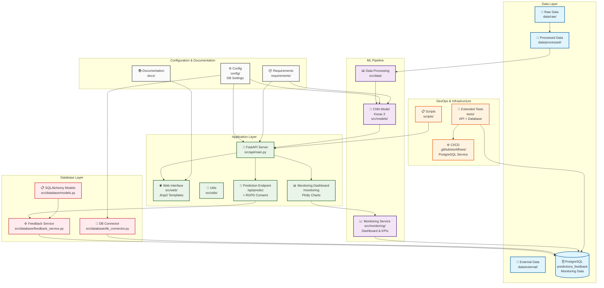

# 🐱🐶 Computer Vision Cats & Dogs - V2 Monitoring

[](https://www.python.org)
[](https://fastapi.tiangolo.com/)
[](https://keras.io/)
[](https://www.postgresql.org/)
[](https://docs.pytest.org/en/stable/)
[](LICENSE)

<div align="center">

<h3>Classification d'images avec Keras et exposition du modèle via Fast API</br></h3>
<h3>Version enrichie avec monitoring et feedback utilisateur</br></h3>

[Explore the docs](docs/)

</div>

---

## 📌 Introduction

Il s'agit de la version 2 du projet, dans une série de 3 versions, la version 2 a pour objectif de développer une solution de monitoring (incluant le "human feedback loop") et la version 3 de proposer une solution ML Ops avancée (monitoring avancé, tests automatisés et déploiement continu).

## 🔍 Vue d'ensemble

Cette version 2 étend le projet de classification d'images en ajoutant des fonctionnalités de monitoring avancées, une collecte de feedback utilisateur conforme RGPD, et un dashboard de surveillance en temps réel.

### ✨ Nouvelles fonctionnalités V2

- **Base de données PostgreSQL** : Stockage persistant des prédictions et métriques
- **Collecte de feedback utilisateur** : Système de satisfaction avec respect du RGPD
- **Dashboard de monitoring** : Visualisations interactives avec Plotly
- **Tests automatisés étendus** : Tests de base de données et API
- **Pipeline CI/CD complet** : Tests automatiques sur GitHub Actions

## 🏗️ Architecture de l'application

### 🛠️ Stack technologique

- **IA** : Keras 3 + TensorFlow (CNN)
- **API** : FastAPI avec authentification par token
- **Base de données** : PostgreSQL avec SQLAlchemy
- **Frontend** : Templates Jinja2 + Bootstrap 5 + Bootstrap Icons
- **Visualisation** : Plotly pour les graphiques interactifs
- **Tests** : pytest avec PostgreSQL de test
- **CI/CD** : GitHub Actions

### 🔄 Architecture fonctionelle



### 📁 Structure du projet

```txt
project-name/
├── .github/
│   ├── workflows/           # CI/CD pipelines
│   └── ISSUE_TEMPLATE/      # Templates d'issues
├── config/                  # Fichiers de configuration
├── data/
│   ├── raw/                 # Données brutes (gitignored)
│   ├── processed/           # Données traitées (gitignored)
│   └── external/            # Données externes/références
├── docker/                  # Dockerfiles et compose
├── docs/                    # Documentation
├── notebooks/               # Jupyter notebooks pour exploration
├── requirements/            # Dépendances par environnement
│   ├── base.txt
│   ├── dev.txt
│   └── prod.txt
├── scripts/                 # Scripts d'automatisation/déploiement
├── src/                     # Code source principal
│   ├── api/                 # APIs et services web
│   ├── data/                # Scripts de traitement des données
│   ├── database/            # Gestion base de données
│       ├── db_connector.py    # Connexion PostgreSQL
│       ├── models.py          # Modèles SQLAlchemy
│       ├── schemas.py         # Schémas Pydantic
│       ├── feedback_service.py# Service métier
│       ├── db_creator.py      # Script création DB
│       └── table_creator.py   # Script création tables
│   ├── models/              # Modèles ML/IA
│   ├── monitoring/          # Monitoring des modèles et de l'application
│       └── dashboard_service.py# Génération graphiques
│   ├── utils/               # Utilitaires partagés
│   └── web/                 # Templates jinja2
│   └── templates/
│       ├── base.html        # Template de base
│       ├── inference.html   # Page de prédiction
│       └── monitoring.html  # Dashboard monitoring
├── tests/                   # Tests unitaires et d'intégration
│   ├── test_api_simple.py   # Tests API
│   └── test_db_simple.py    # Tests base de données
├── .env                     # Variables d'environnement (à configurer)
├── .env.example             # Variables d'environnement exemple
├── .gitignore
├── README.md
├── Makefile                 # Commandes fréquentes
└── pyproject.toml           # Configuration Python/packaging
```

## ⚙️ Fonctionnalités détaillées

### 📊 Monitoring et analytics

#### KPI temps d'inférence

- Temps moyen, minimum, maximum
- Courbe temporelle d'évolution
- Nombre total de prédictions

#### KPI satisfaction utilisateur

- Taux de satisfaction en pourcentage
- Répartition satisfait/insatisfait
- Scatter plot temporel des feedbacks

### 🛡️ Conformité RGPD

- Consentement explicite de l'utilisateur
- Stockage conditionnel des données personnelles
- Métriques anonymes par défaut
- Pas de stockage du nom de fichier sans consentement

### 🗄️ Base de données

#### Table `predictions_feedback`

- id, timestamp, created_at : Identifiants et horodatage
- inference_time_ms, success : Métriques de performance
- prediction_result, proba_cat, proba_dog : Résultats de prédiction
- rgpd_consent, filename : Données RGPD
- user_feedback, user_comment : Feedback utilisateur

## 🚀 Installation et utilisation

### 📋 Prérequis

- Python 3.11+
- PostgreSQL 15+
- Git

### ⚡ Installation

- Cloner le repository
- Créer l'environnement virtuel
- Installer les dépendances via `requirements/base.txt`

### ⚙️ Configuration

- Créer un fichier `.env` à la racine avec la configuration PostgreSQL (DB_HOST, DB_PORT, DB_NAME, DB_USER, DB_PWD, DB_TABLE_MONITORING) et le token API.
- Voir le fichier `.env.example` pour exemple.

### 🗃️ Initialisation de la base de données

- Exécuter successivement : `db_connector.py` pour tester la connexion, puis  `db_creator.py` pour créer la base, et enfin `table_creator.py` pour créer la table de monitoring.

### 🚀 Lancement de l'application

Démarrer l'API avec `scripts/run_api.py` puis accéder à :

- http://127.0.0.1:8000 : Interface principale
- http://127.0.0.1:8000/docs : Documentation API
- http://127.0.0.1:8000/monitoring : Dashboard monitoring

- Page de documentation de l'API (Swagger) :


- Page d'accueil de l'application :


## 🧪 Tests

### 🔧 Tests manuels

- Exécuter `tests/test_db_simple.py` pour les tests base de données
- Exécuter `tests/test_api_simple.py` pour les tests API.

### 🤖 Tests automatisés (CI/CD)

Le pipeline GitHub Actions exécute automatiquement les tests de connexion PostgreSQL, la vérification de la structure des tables, et les tests de l'API avec modèle factice.

## 🔌 API Endpoints

### 🎯 Prédiction

- POST `/api/predict` : Classification d'image avec collecte de feedback
- POST `/api/update-feedback` : Mise à jour du feedback utilisateur

### 📈 Monitoring

- GET `/api/statistics` : Statistiques globales
- GET `/api/recent-predictions` : Dernières prédictions
- GET `/monitoring` : Dashboard web interactif

### ⚡ Système

- GET `/health` : État de l'API et de la base de données
- GET `/api/info` : Informations sur le modèle

## 📈 Évolutions par rapport à la V1

```markdown
| Fonctionnalité  | V1              | V2                        |
|-----------------|-----------------|---------------------------|
| **Stockage**    | Fichiers CSV    | PostgreSQL                |
| **Monitoring**  | Logs basiques   | Dashboard interactif      |
| **Feedback**    | Aucun           | Collecte utilisateur RGPD |
| **Visualisation** | Aucune        | Graphiques Plotly         |
| **Tests**       | API uniquement  | API + Base de données     |
| **CI/CD**       | Basique         | Pipeline complet          |
```

## 💻 Développement

### 🏛️ Architecture des données

Le système collecte et analyse les temps d'inférence pour optimisation des performances, la précision des prédictions pour amélioration du modèle, la satisfaction utilisateur pour amélioration de l'expérience, et les commentaires utilisateur pour insights qualitatifs.

### 🔮 xtensibilité

La V2 prépare les évolutions vers la V3 MLOps avec une infrastructure de données établie, des métriques standardisées, un pipeline de tests robuste, et un monitoring des performances en place.

## 📄 Licence

MIT - Projet éducatif à des fins pédagogiques

## 🤝 Contributions

Ce projet est utilisé dans un cadre pédagogique. Les contributions sont bienvenues pour améliorer l'expérience d'apprentissage.

---

**Version** : 2.0.0  
**Status** : Production ready pour démonstration  
**Next** : V3 avec MLOps avancé  
