# Computer Vision - Classification d'images Cats & Dogs

[](https://www.python.org)
[](https://fastapi.tiangolo.com/)
[](https://keras.io/)
[](https://www.postgresql.org/)
[](https://docs.pytest.org/en/stable/)
[](LICENSE)
[](CONTRIBUTING.md)

<div align="center">

<h3>Classification d'images avec Keras et exposition du modèle via Fast API</br></h3>

[Explore the docs](docs/)

</div>

---

## 📌 Introduction

Ce projet est à vocation pédagogique sur des thématiques IA et MLOps. Il permet de réaliser des tâches de Computer Vision et spécifiquement de la classification d'images par la reconnaissance de chats et de chiens.  
Il est composé de :

- Un modèle de computer vision développé avec Keras 3 selon une architecture CNN. Voir le tutoriel Keras ([lien](https://keras.io/examples/vision/image_classification_from_scratch/)).
- Un service API développé avec Fast API, qui permet notamment de réaliser les opérations d'inférence (i.e prédiction), sur la route `/api/predict`.
- Une application web minimaliste (templates Jinja2).
- Des tests automatisés minimalistes (pytest).
- Un pipeline CI/CD minimaliste (Github Action).

## 🏗️ Architecture de l'application

```mermaid
graph TB
    subgraph "Data Layer"
        A[📁 Raw Data<br/>data/raw/] --> B[📁 Processed Data<br/>data/processed/]
        C[📁 External Data<br/>data/external/]
    end
    
    subgraph "ML Pipeline"
        D[🧠 CNN Model<br/>Keras 3<br/>src/models/] 
        E[📊 Data Processing<br/>src/data/]
        F[📈 Monitoring<br/>src/monitoring/]
    end
    
    subgraph "Application Layer"
        G[🚀 FastAPI Server<br/>src/api/]
        H[🌐 Web Interface<br/>src/web/<br/>Jinja2 Templates]
        I[🔧 Utils<br/>src/utils/]
        R[🎯 Prediction Endpoint<br/>/api/predict]
    end
    
    subgraph "DevOps & Infrastructure"
        K[⚙️ CI/CD<br/>.github/workflows/]
        L[📋 Scripts<br/>scripts/]
        M[🧪 Tests<br/>tests/<br/>pytest]
    end
    
    subgraph "Configuration & Documentation"
        N[⚙️ Config<br/>config/]
        O[📚 Documentation<br/>docs/]
        Q[📦 Requirements<br/>requirements/]    
    end
    
    %% Data Flow
    B --> E
    E --> D
    D --> G
    G --> H
    G --> R
    
    %% API Routes
    %%G -.->|/api/predict| R[🎯 Prediction<br/>Endpoint]
    
    %% DevOps Integration
    M --> K
    L --> G
    
    %% Configuration
    N --> G
    N --> D
    Q --> G
    Q --> D
    
    %% Documentation & Development
    O --> H
    
    %% Styling
    classDef dataClass fill:#e1f5fe,stroke:#01579b,stroke-width:2px
    classDef mlClass fill:#f3e5f5,stroke:#4a148c,stroke-width:2px
    classDef appClass fill:#e8f5e8,stroke:#1b5e20,stroke-width:2px
    classDef devopsClass fill:#fff3e0,stroke:#e65100,stroke-width:2px
    classDef configClass fill:#fafafa,stroke:#424242,stroke-width:2px
    
    class A,B,C dataClass
    class D,E,F mlClass
    class G,H,I,R appClass
    class K,L,M devopsClass
    class N,O,Q configClass
```



## 📁 Structure du projet

```txt
project-name/
├── .github/
│   ├── workflows/           # CI/CD pipelines
│   └── ISSUE_TEMPLATE/      # Templates d'issues
├── config/                  # Fichiers de configuration
├── data/
│   ├── raw/                 # Données brutes (gitignored)
│   ├── processed/           # Données traitées (gitignored)
│   └── external/            # Données externes/références
├── docker/                  # Dockerfiles et compose
├── docs/                    # Documentation
├── notebooks/               # Jupyter notebooks pour exploration
├── requirements/            # Dépendances par environnement
│   ├── base.txt
│   ├── dev.txt
│   └── prod.txt
├── scripts/                 # Scripts d'automatisation/déploiement
├── src/                     # Code source principal
│   ├── api/                 # APIs et services web
│   ├── data/                # Scripts de traitement des données
│   ├── models/              # Modèles ML/IA
│   ├── monitoring/          # Monitoring des modèles
│   ├── utils/               # Utilitaires partagés
│   └── web/                 # Templates jinja2
├── tests/                   # Tests unitaires et d'intégration
├── .env.example             # Variables d'environnement exemple
├── .gitignore
├── README.md
├── Makefile                 # Commandes fréquentes
└── pyproject.toml           # Configuration Python/packaging
```

## 🛠️ Commandes utiles

*Section minimaliste à faire évoluer.*

```bash
make env           # Installer les dépendances dans un environnement virtuel
```

## 🎯 API

Lorsque l'environnement virtuel est activé, vous pouvez lancer le serveur de l'API ...

```bash
python scripts/run_api.py
```

... et visiter la page de documentation Swagger :


## 📊 Application web

Lorsque l'environnement virtuel est activé, vous pouvez lancer le serveur de l'API ...

```bash
python scripts/run_api.py
```

... et utiliser l'application web :


## 📄 Licence

MIT - voir LICENSE pour plus de détails.
